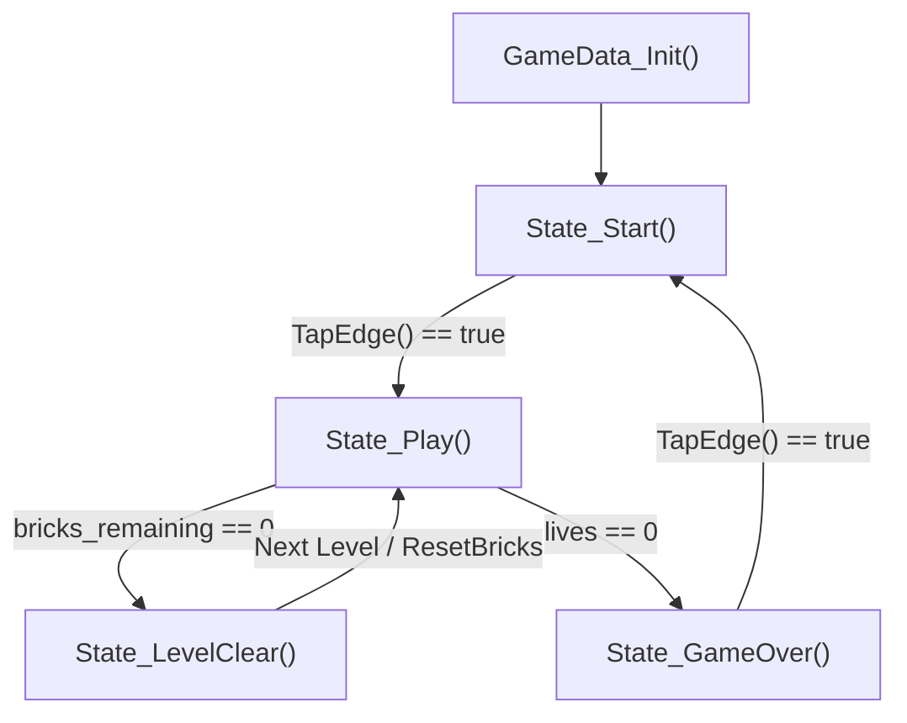
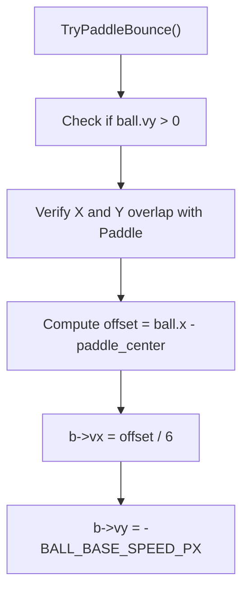

# Breakout Game Engine

> **Relevant source files**  
> - `Core/Inc/game.h`  
> - `Core/Src/game.c`  
  
## Purpose and Scope  
  
This section provides a deep technical dive into the Breakout game engine implemented for the STM32H750B-DK discovery board. The engine is self-contained within `Core/Inc/game.h` and `Core/Src/game.c`. It replaces traditional retro arcade platforms with a lightweight, touch-driven Arkanoid clone that integrates directly into the main superloop through a function-pointer state machine and uses the Board Support Package (BSP) LCD utility library for rendering.  

#### Credit:

https://github.com/Klemen2/OR-Projekt/tree/main/Pacman
https://github.com/AljazJus/Stm32H750B-DK_Minesweeper
  
Sources: `Core/Inc/game.h`, `Core/Src/game.c`  
  
---  
  
## 1. Core Data Structures and Layout Constants  
  
The game state is encapsulated within the `GameData` structure, mirroring the expected interface of legacy demo modules (such as Pacman) so that `Core/Src/main.c` requires minimal alterations.  
  
### Layout & Dimension Constants  
  
The playfield geometry and timing parameters are defined as preprocessor macros in `Core/Inc/game.h:29-44`:  
  
* `BRICK_ROWS` (5) and `BRICK_COLS` (10): Define the brick matrix dimensions (`game.h:30-31`).  
* `BRICK_GAP_PX` (2) and `BRICK_HEIGHT_PX` (14): Spacing and height for grid elements (`game.h:32-33`).  
* `PADDLE_WIDTH_PX` (64) and `PADDLE_HEIGHT_PX` (8): Dimensions of the player-controlled paddle (`game.h:36-37`).  
* `BALL_RADIUS_PX` (4) and `BALL_BASE_SPEED_PX` (3): Ball size and baseline velocity step size (`game.h:40-41`).  
* `FRAME_INTERVAL_MS` (16): Enforces an approximate 60 Hz physics and redraw cadence (`game.h:44`).  
  
### Struct Definitions  
  
The game relies on four primary data structures defined in `Core/Inc/game.h:46-92`:  
  
* `Ball`: Tracks center coordinates `(x, y)` and integer velocity vectors `(vx, vy)` (`game.h:47-52`).  
* `Paddle`: Tracks top-left coordinates `(x, y)` (`game.h:54-57`).  
* `Brick`: Tracks individual status (`alive`) and display color (`game.h:59-62`).  
* `GameData`: Master structure containing system parameters (`screen_x`, `screen_y`, `touch_x`, `touch_y`, `timer`), the function pointer `refresh`, input tracking flags, game entities, and progress counters (`score`, `lives`, `level`) (`game.h:66-92`).  
  
```  
+-------------------------------------------------------------+  
|                        GameData                             |  
+-------------------------------------------------------------+  
| screen_x, screen_y : uint32_t                               |  
| touch_x, touch_y   : uint32_t                               |  
| timer              : uint32_t                               |  
| refresh(GameData*) : function pointer                       |  
+-------------------------------------------------------------+  
| touch_active       : uint32_t                               |  
| prev_touch_active  : uint32_t                               |  
| last_step_tick     : uint32_t                               |  
| ball               : Ball (x, y, vx, vy)                    |  
| paddle             : Paddle (x, y)                          |  
| bricks             : Brick[BRICK_ROWS][BRICK_COLS]          |  
| bricks_remaining   : uint32_t                               |  
| score, lives, level: uint16_t / uint8_t                     |  
+-------------------------------------------------------------+  
```  
  
Sources: `Core/Inc/game.h:29-92`  
  
---  
  
## 2. Function-Pointer State Machine  
  
The game engine operates a discrete state machine driven entirely by the `refresh` function pointer inside `GameData`. The main superloop executes whatever state handler `data->refresh` currently points to on each iteration.  
  
### State Handlers  
  
Four static state handlers are implemented in `Core/Src/game.c:45-48`:  
  
1. `State_Start`: Waits for initial touchscreen interaction to launch the ball.  
2. `State_Play`: Executes the main physics, collision detection, and redrawing loop.  
3. `State_LevelClear`: Pauses briefly when all bricks are cleared, increments the level, and resets the grid.  
4. `State_GameOver`: Displays terminal failure text and awaits input to restart.  
  

  
Sources: `Core/Src/game.c:45-48`, `Core/Inc/game.h:74`  
  
---  
  
## 3. Ball Physics, Wall Reflection, and Paddle 'English'  
  
The engine avoids lookup tables for ball reflection, utilizing integer velocity vectors `vx` and `vy` updated per physics frame.  
  
### Wall and Boundary Collisions  
  
Handled by `ReflectOffWalls()`, the ball checks bounds against the left/right screen edges and the bottom of the HUD (`HUD_HEIGHT_PX`). Collisions invert the corresponding velocity vector component and clamp position to prevent clipping (`game.c:138-154`). If the ball crosses below the paddle boundary in `State_Play`, a life is decremented, and entities are reset via `ResetBallAndPaddle()` (`game.c:118-127`).  
  
### Paddle 'English' Mechanics  
  
When the ball hits the paddle (`TryPaddleBounce()`), the rebound angle is not fixed. Instead, arcade-style "English" is applied by calculating the collision offset from the paddle's center axis (`game.c:171-178`):  
  
$$\text{offset} = x_{\text{ball}} - x_{\text{center}}$$  
  
$$v_x = \frac{\text{offset}}{6}$$  
  
If the resulting horizontal velocity `vx` evaluates to zero, a minor directional bias is assigned randomly to prevent vertical looping (`game.c:175`). The vertical velocity component is reset upward to `-BALL_BASE_SPEED_PX` (`game.c:176`):  
  
$$v_y = -v_{\text{base}}$$  
  

  
Sources: `Core/Src/game.c:118-179`  
  
---  
  
## 4. Brick Grid and Collision Engine  
  
The brick matrix is dynamically scaled to match the screen width.  
  
### Grid Initialization  
  
`InitBricks()` calculates individual brick widths based on `screen_x`, accounting for column gaps, and populates the grid with row-specific colors defined in `kRowColors` (`game.c:68-80`).  
  
### Collision Detection  
  
`TryBrickBounce()` iterates over active bricks, generating bounding boxes via `BrickRect()` (`game.c:82-89`). It computes the closest point on the brick rectangle to the ball's center and checks distance against `BALL_RADIUS_PX`. Upon impact:  
  
* The brick's `alive` flag is cleared (`game.c:75`).  
* `bricks_remaining` is decremented (`game.c:86`).  
* Score is increased, and the ball's vertical velocity is inverted.  
* Collision resolution is restricted to one brick per frame to maintain physics stability (`game.c:181`).  
  
Sources: `Core/Src/game.c:68-101`, `Core/Src/game.c:182-194`  
  
---  
  
## 5. HUD, Rendering, and Frame Timing  
  
Because the board template does not configure hardware double-buffering, the engine implements an *erase-and-redraw* strategy rather than clearing the full display every frame (`game.c:15-17`):  
  
1. Only moving object footprints (ball and paddle old positions) are overwritten with background color (`COLOR_BG`).  
2. New positions are rendered.  
3. The HUD and brick matrix are updated selectively.  
  
### HUD Drawing  
  
`DrawHud()` renders the top status banner (`SCORE`, `LIVES`, `LVL`) using `UTIL_LCD` font rendering primitives over a dark blue header rectangle (`COLOR_HUD_BG`) (`game.c:103-116`).  
  
### Timing Control  
  
Frame pacing is managed by comparing current ticks against `last_step_tick` against `FRAME_INTERVAL_MS` (16 ms) to target a 60 Hz execution rate (`game.h:44`). Touch coordinates are polled externally and passed into `GameData`, with rising-edge detection handled by `TapEdge()` (`game.c:52-58`).  
  
Sources: `Core/Src/game.c:15-17`, `Core/Src/game.c:52-116`, `Core/Inc/game.h:44`  
  
---  
  
## 6. Initialization and Reset API  
  
External integration points exposed in `Core/Inc/game.h` include:  
  
* `GameData_Init(uint32_t max_score)`: Allocates and initializes default screen boundaries, resets scores, calls `InitBricks()`, and sets initial state pointers to `State_Start` (`game.h:97`).  
* `GameReset(GameData *data)`: Resets ball, paddle, and lives without wiping top-level scores or current level parameters (`game.h:102`).  
  
Sources: `Core/Inc/game.h:97-102`, `Core/Src/game.c:118-127`
